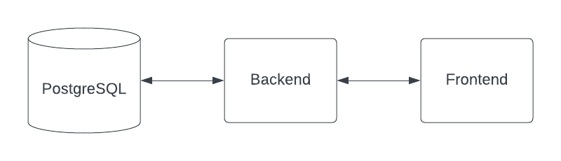

# Pre-Test Bootcamp DevOps

## knowledge base

1. Apa yang anda ketahui tentang DevOps?

-> DevOps adalah work team yang menggabungkan developer dan operator IT untuk membuat software lebih cepat dan berkualitas. tim bekerja sama dalam proses pembuatan, pengujian, dan me-release software dengan efisien menggunakan alat otomatisasi untuk menghasilkan software yang dapat diandalkan oleh pengguna

2. Apa yang anda ketahui tentang Infrastructure?

-> Infrastruktur adalah fondasi atau alat yang dibutuhkan buat bikin software atau sistem kerja. seperti agar software bisa jalan dan bisa diakses oleh orang membutuhkan Infrastruktur ini bisa fisik (kayak server dan kabel) atau virtual (kayak server di dalam komputer/cloud). Jadi infrastruktur memungkinkan aplikasi untuk berjalan dan beroperasi dengan baik.

3. Apa yang anda ketahui tentang server, sebutkan implementasi berserta contohnya?

-> Server adalah komputer atau sistem yang menyediakan layanan atau sumber daya kepada klien melalui jaringan.

contoh : Web Server - Mengirimkan halaman web kepada pengguna melalui protokol HTTP. Contoh: Apache, Nginx.

4. Mengapa server dibutuhkan dalam pengembangan/development suatu software?

-> karena kita dapat menjadikan uji coba untuk testing software di lingkugan yang hampirsama dengan saat software udah release. Jadi, jika ada bug/error dapat di ketahuan sebelum sampai ke end-user. atau server juga dapat membantu memudahkan kita saat mengembangkan software itu dalam sebuah tim dan memudahkan dalam maintenance 

5. Apa yang anda ketahui mengenai Virtualisasi dan Container?

-> Virtualisasi adalah teknologi yang memungkinkan beberapa mesin virtual (VM) berjalan pada satu mesin fisik.

Container adalah lingkungan terisolasi di atas sistem operasi yang sama, memungkinkan aplikasi untuk berjalan konsisten di berbagai lingkungan.

6. Mengapa teknology container saat ini sangat populer?

-> karena teknologi container sangat populer sekarang karena membuatnya lebih mudah untuk menjalankan dan mengelola program di berbagai komputer, serta lebih hemat sumber daya dan aman.

7. Apa yang anda ketahui tentang Orchestration Container System?

-> alat atau platform yang digunakan untuk mengotomatisasi, mengelola, dan mengatur penyebaran serta pengelolaan aplikasi dalam lingkungan container.

Cara pengerjaan, silahkan update file ini tulis jawabanya di bawah ini

## Task 1 (Virtualization)

- Buatlah sebuah VM dengan kententuan
  - username: `<github_user>` contoh `dimasm93`
  - hostname: `<email_without_at>` contoh `dimas.tabeldata.com`
  - OS: `ubuntu-20.04` atau `centos-7`
- Install webserver `nginx`
- Buatlah web profile temen-temen kemudian deploy ke webserver nginx tersebut yang telah di deploy
  
(kirimkan hasil screenshotnya simpan dalam folder `screenshot` dengan nama `task1.png`)

## Task 2 (Container)

Jika saya memiliki architecture seperti berikut:

Dimana berikut adalah configurasi docker image:

1. Backend container
  - image: `dimmaryanto93/udemy-springboot-app:latest`
  - port: `8080`
  - env: 
    - `DATABASE_HOST`: `<ip-domain-db>`
    - `DATABASE_PORT`: `5432` 
    - `DATABASE_NAME`: `<db-name>`
    - `DATABASE_PASSWORD`: `<db-password>`
    - `APPLICATION_PORT`: `8080`
  need:
    - Database PostgreSQL v14.2
2. Frontend container
  - image: `dimmaryanto93/udemy-angular-app:latest`
  - port: `80`
  - env:
    - `APPLICATION_PORT`: `80`
    - `NGINX_ROOT_DOCUMENT`: `/var/www/html`
    - `BACKEND_HOST`: `<ip-backend-apps>`
    - `BACKEND_PORT`: `<port-backend-apps>`
    - `BACKEND_CONTEXT_PATH`: `/`
  - need:
    - Backend container

Silahkan buat docker-compose filenya, kemudian simpan dalam folder `tasks` dengan nama `docker-compose.yaml`

